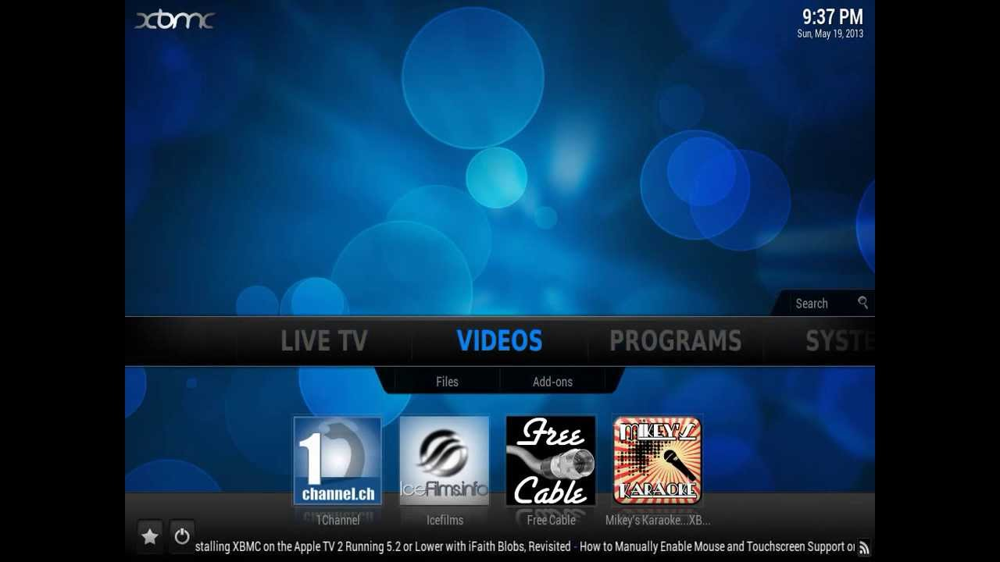
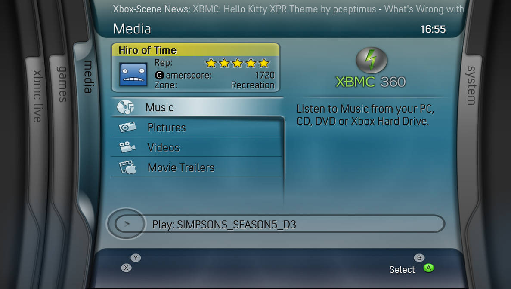
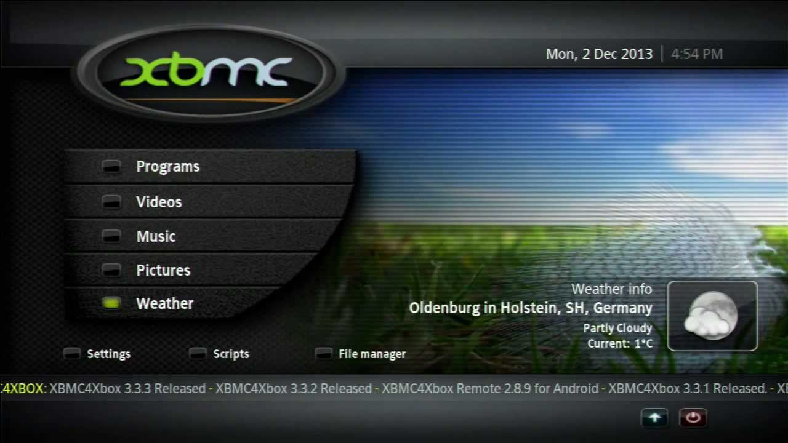

# XBMC-Classic-Skins
Classic skins for XBMC4Xbox and Xbox Media Player, archived for preservation purposes.

All skins (except Alaska / Alaska Revisited & TheOrbs) for XBMC4Xbox are .zip files to facilitate easy installation directly onto your Xbox. (Repository WIP, more screenshots coming soon!)

Accepting submissions, please reach out if you've got skins that are missing from here (or, even better, Xbox Media Player era skins!)

# Xbox Media Centre
## [Amped](https://github.com/faithvoid/XBMC-Classic-Skins/raw/refs/heads/main/skin/amped.zip)

## [Confluence](https://github.com/faithvoid/XBMC-Classic-Skins/raw/refs/heads/main/skin/Confluence.zip)

## [MC360](https://github.com/faithvoid/XBMC-Classic-Skins/raw/refs/heads/main/skin/MC360.zip)

## [Project Mayhem 3](<https://github.com/faithvoid/XBMC-Classic-Skins/raw/refs/heads/main/skin/Project Mayhem III.zip>)

# Xbox Media Player
- TBA!
